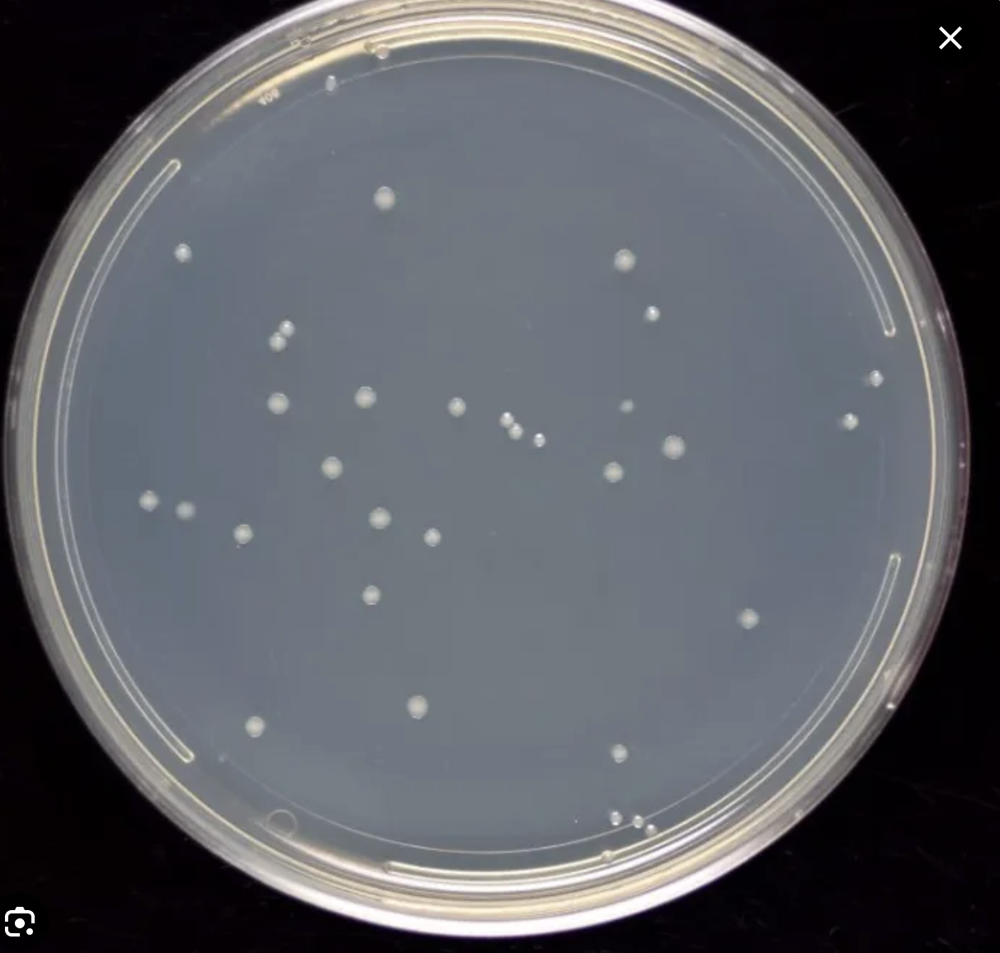
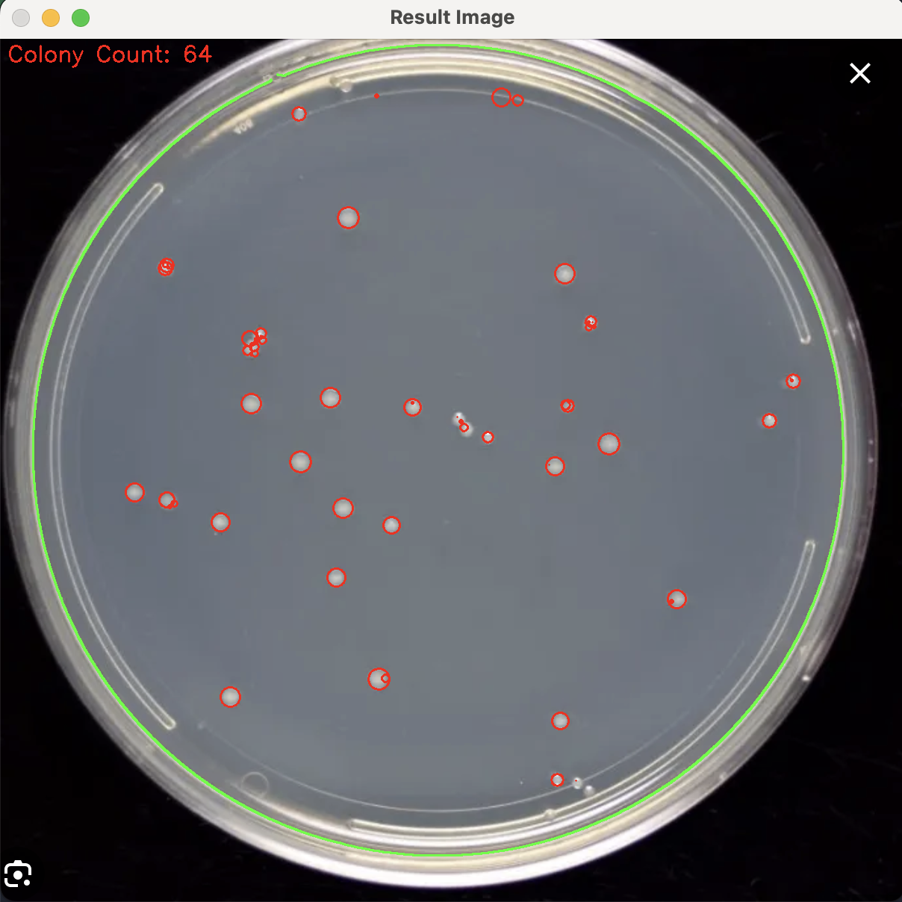

# Colony Counter 

Count colonies from petri dish images using a python script

## Sample outputs

### Colony Counter Results

The following table shows the input colony images and their corresponding output images with the colony count and superimposed points:

| Input Image | Output Image |
|-------------|--------------|
|  |  |

## Usage

To use the Colony Counter, first, make sure you have Python installed on your system. Then, follow these steps:

1. Install the required dependencies using pip:
   ```bash
   pip install opencv-python numpy
   ```
2.  Clone the repository
    ```bash
    git clone https://github.com/viraatdas/ColonyCounter.git
    ```
3. Navigate to the project directory
   ```bash
   cd ColonyCounter/
   ```
4. Run the colony counter script with the path to the input image as an argument:
    ```bash
    python count.py sample-images/input/sample_1.png
    ```

This will process the input image, count the colonies, and generate an output image displaying the detected colonies along with the colony count in a window.

## Todo (convert these to GitHub issues)
- [ ] Improve the algorithm to achieve higher accuracy
- [ ] Use manual validation to check if it works ona  diverse dataset
- [ ] Add batch capability to process multiple files
- [ ] Convert to webapp to make this more accessible
  - [ ] Maybe create a lambda that is accessible as an API 

## Contributing
PRs are always welcome for any improvement

## Citation
If you use this Colony Counter in your research work or project and want to cite, you can use the following BibTex entry: 

```
@misc{colony-counter,
title={Colony Counter},
author={Viraat Das},
year={2024},
howpublished={\url{https://github.com/viraatdas/ColonyCounter}},
}
```

